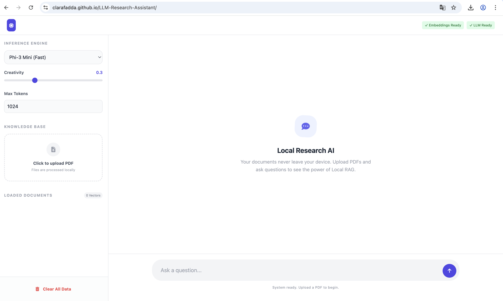

# AI Research Assistant: Privacy-First Local RAG

### Click the image below to launch the demo video:

[](https://youtu.be/nzbVero9gsc)

---
<details>
  <summary>Table of Contents</summary>
  <ol>
    <li><a href="#about-the-project">About The Project</a></li>
    <li><a href="#key-features">Key Features</a></li>
    <li><a href="#technology-stack">Technology Stack</a></li>
    <li><a href="#local-setup-&-development">Local Setup & Development</a></li>
    <li><a href="#technical-architecture">Technical Architecture</a></li>
    <li><a href="#privacy-and-data-security">Privacy and Data Security</a></li>
  </ol>
</details>

---

## About The Project

A browser-based research tool designed for automated Literature Review and document analysis. This application utilizes Retrieval-Augmented Generation (RAG) to provide answers based exclusively on uploaded PDF documents.

### Key Privacy Feature
Unlike traditional AI tools, this application processes all data locally in the browser. No documents, embeddings, or chat histories are ever sent to a server. The Large Language Model (LLM) and Embedding models are downloaded once and run entirely on the client's hardware.

🔗 [**View Live Demo**](https://clarafadda.github.io/LLM-Research-Assistant/)

---

## Key Features

1.  **Local Ingestion:** Drag-and-drop PDF processing with automatic text chunking.
2.  **Semantic Search:** Vector-based retrieval to find relevant context for user queries.
3.  **Context-Aware Chat:** LLM-generated responses that strictly adhere to provided document context.
4.  **Source Attribution:** Citations provided for every AI claim based on document metadata.
5.  **Responsive Design:** Fully optimized interface for both desktop and mobile environments.

---

## Technology stack

* **Large Language Model:** WebLLM (utilizing Phi-3 or Llama-3 via WebGPU).
* **Embeddings Engine:** Transformers.js (running Xenova/all-MiniLM-L6-v2).
* **PDF Processing:** PDF.js.
* **Vector Storage:** Custom In-Memory Vector Store with Cosine Similarity.
* **Frontend:** Vanilla JavaScript and Tailwind CSS.

---

## Local Setup & Development

Due to the use of JavaScript Modules and browser security policies (CORS), the project must be served through a local web server rather than opened as a static file.

### Prerequisites
* A modern web browser with **WebGPU** support (e.g., Google Chrome, Microsoft Edge).
* A local development server.

### Installation Steps

1.  **Clone the Repository:**
    ```bash
    git clone [https://github.com/yourusername/research-assistant.git](https://github.com/yourusername/research-assistant.git)
    cd research-assistant
    ```

2.  **Launch a Local Server:**
    
    * **Option A: VS Code (Recommended)**
        Install the "Live Server" extension, open `index.html`, and click the "Go Live" button in the status bar.
    
    * **Option B: Python**
        Run the following command in your terminal:
        ```bash
        python -m http.server 8000
        ```
        Then navigate to `http://localhost:8000`.

    * **Option C: Node.js**
        ```bash
        npx serve .
        ```

3.  **Model Initialization:**
    Upon first launch, the application will download the required AI models (approximately 2GB - 5GB depending on the selected model). These are cached in the browser's IndexedDB for future use.

---

### Usage Guide

1.  **Model Selection:** Select your preferred model from the sidebar. Note that "Llama-3" offers higher reasoning capabilities but requires more system RAM.
2.  **Document Upload:** Drag and drop academic PDFs into the "Knowledge Base" section.
3.  **Analysis:** Wait for the "Embeddings Ready" status. The status bar will track processing progress.
4.  **Querying:** Enter research questions in the chat bar. Use the "Creativity" slider to adjust the response style (Lower for factual accuracy, higher for brainstorming).

---

## Technical Architecture

The application follows a modular architecture to ensure maintainability:
* `index.html`: The UI layer using Tailwind CSS for responsive layout.
* `js/pdf.js`: Handles extraction and recursive text chunking.
* `js/transformers.js`: Manages the vector database and similarity calculations.
* `js/llm.js`: Orchestrates the WebLLM engine and inference configuration.
* `js/main.js`: Acts as the controller, managing application state and UI updates.

---

## Privacy and Data Security

By leveraging WebGPU and WebAssembly (WASM), this project demonstrates a "Zero-Server" AI architecture. 
* **Data Sovereignty:** Sensitive research papers never leave the local machine.
* **Offline Capability:** Once models are cached, the application can perform inference without an active internet connection.
* **No API Keys:** Since inference happens on the user's hardware, no external API subscriptions (like OpenAI or Anthropic) are required.

---

### Project Status

**Current Version:** 1.0.0 (Fully Functional)
**Deployment:** Polished for production with mobile-responsive support.